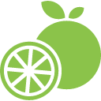

## Fruition

> Use JavaScript to:
* read a JSON file of data,
* loop through it,
* use maps.

We want to find the best place to buy several types fruit: apples, bananas, and oranges. We like fruit. It is delicious. Another computer programmer has given us this information, in `JSON` format:


{
  "woolingsworth": {
    "apple": 4,
    "bananas": 3,
    "oranges": 12
  },

  "chockers": {
    "bananas": 2,
    "apple": 5,
    "oranges": 4
  },

  "pickle pay": {
    "bananas": 4,
    "oranges": 7
  }
}


Write functions that:

* find the seller of the cheapest oranges;
* return the prices and sellers of apples, order ascending by price;
* return the prices and sellers of apples, order descending by price;
* return the cheapest fruit;
* return the seller of the cheapest fruit.
